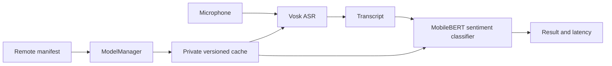

# Architecture

## Runtime flow



`ModelManager` first fetches the authoritative manifest from the
`edge-ai-models` repository. It rejects missing models, non-HTTPS URLs, malformed
SHA-256 values, and invalid sizes. Each artifact is downloaded to
`<version>.download`, checked for exact byte size and SHA-256 digest, prepared
under `<version>.staged`, and renamed into the active version. Preferences are
updated only after activation. This prevents a partial or untrusted file from
becoming active.

## Storage layout

```text
files/edge-models/
  vosk-small-en-us/
    <active-version>/
  mobilebert-text-classifier/
    <active-version>/
```

The active path and version are stored in private preferences. The previous path
and version are retained as last-known-good metadata for a future automatic
rollback implementation. The current demo prevents failed candidates from
replacing the active version but does not automatically roll back after a
runtime load failure.

## Scope decision

A production platform could separate model delivery, storage, networking,
integrity, observability, inference adapters, and feature code into independent
Gradle modules. For this time-boxed demo, creating mostly small modules would add
build and dependency-injection overhead without improving the demonstrated
behavior. The current implementation therefore uses clear package-level
boundaries within one application module. A production extraction could use:

```text
app
feature:voice-memo
core:model-manager
core:network
core:storage
core:crypto
core:observability
inference:asr-vosk
inference:text-mediapipe
inference:pipeline
```

The dependency direction would point from the app/feature toward interfaces,
with transport, storage, crypto, and runtimes supplied as implementations.
