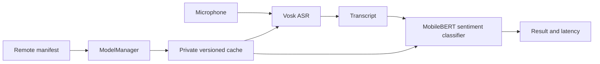

# Architecture

## Runtime flow



`ModelManager` first fetches the authoritative manifest from the
`edge-ai-models` repository. It rejects missing models, non-HTTPS URLs, malformed
SHA-256 values, and invalid sizes. Each artifact is downloaded to
`<version>.download`, checked for exact byte size and SHA-256 digest, prepared
under `<version>.staged`, and renamed into the active version. Preferences are
updated only after activation. This prevents a partial or untrusted file from
becoming active.

## Storage layout

```text
files/edge-models/
  vosk-small-en-us/
    0.15/
  mobilebert-text-classifier/
    1/
```

The active path and version are stored in private preferences. The previous path
and version are retained as rollback metadata.

## Scope decision

The earlier proposed repository shape is appropriate for a larger platform, but
creating many nearly empty Gradle modules would add build and DI overhead without
improving this demo. The code uses package-level boundaries now. The intended
production modules are:

```text
app
feature:voice-memo
core:model-manager
core:network
core:storage
core:crypto
core:observability
inference:asr-vosk
inference:text-mediapipe
inference:pipeline
```

The dependency direction would point from the app/feature toward interfaces,
with transport, storage, crypto, and runtimes supplied as implementations.
