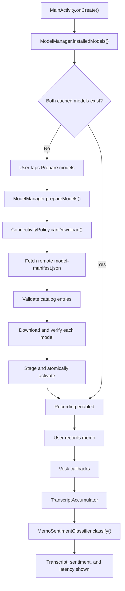
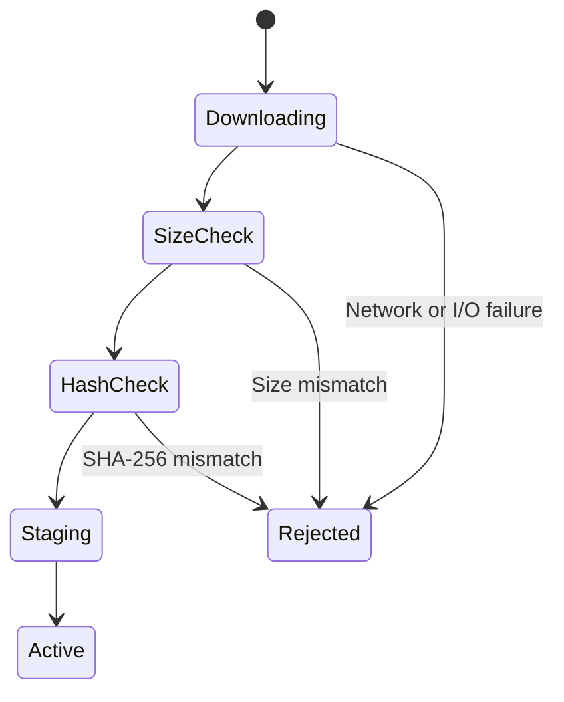
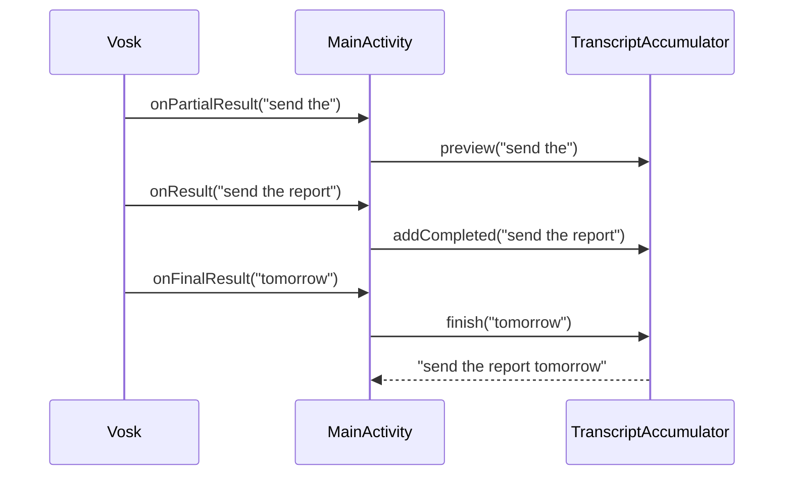

# TANUHDemo Code Flow

This document explains how Smart Voice Notes moves through the code from app
launch to OTA model preparation, offline transcription, and sentiment analysis.

## 1. Main components

| Component | Responsibility |
| --- | --- |
| `MainActivity` | UI state, microphone permission, Vosk session, and pipeline coordination |
| `ModelManager` | Remote catalog, download, integrity checks, staging, activation, and registry |
| `ConnectivityPolicy` | Validated-network and unmetered/metered decision |
| `ModelManifest` / `ModelSpec` | Remote JSON representation |
| `TranscriptAccumulator` | Combines Vosk's segmented callbacks into one memo |
| `MemoSentimentClassifier` | Loads MobileBERT and performs positive/negative sentiment classification |

## 2. Overall flow



## 3. App launch and cache restoration

Android launches `MainActivity.onCreate()`.

1. Views and click listeners are initialized.
2. `ModelManager` is created with the application context.
3. `ModelManager.installedModels()` reads the private `model_registry`
   preferences.
4. For each required model, the registry must contain its version, path,
   runtime, format, source URL, checksum, and size.
5. The active path must still exist.
6. `updateReadyState()` enables recording only when both required IDs exist:
   - `vosk-small-en-us`
   - `mobilebert-text-classifier`

This launch check verifies registry completeness and file presence. It does not
rehash an already active model on every launch.

## 4. Model preparation

`MainActivity.prepareModels()` disables recording and calls
`ModelManager.prepareModels()` on a single background executor.

### 4.1 Network decision

`ConnectivityPolicy.canDownload()` checks:

- An active network exists.
- Android reports it as validated.
- It is unmetered, unless the user enabled metered downloads.

If connectivity is unsuitable but both models are cached, the verified cache is
returned. Without a complete cache, preparation fails with a user-visible
message.

### 4.2 Remote catalog

`ModelManager.fetchManifest()` requests:

```text
https://raw.githubusercontent.com/UpadhyayJitesh/edge-ai-models/main/model-manifest.json
```

`ModelManifest.parse()` converts the JSON into `ModelSpec` records. Each required
record must provide:

```text
id, version, runtime, format, url, sha256, size
```

`validateSpec()` rejects non-HTTPS URLs, malformed SHA-256 values, and invalid
byte sizes. The catalog must contain both required model IDs.

## 5. Download, trust, and activation

`ensureInstalled()` handles each required model.

### Cache hit

When the active registry version matches the remote version and its path exists,
the model is reused immediately.

### Cache miss or update

The model passes through these states:



Files are prepared under:

```text
files/edge-models/<model-id>/
  <version>.download
  <version>.staged/
  <version>/
```

1. `download()` writes to `<version>.download` and flushes it to disk.
2. Its exact byte count is compared with the manifest.
3. `verifyChecksum()` calculates SHA-256 and compares it with the manifest.
4. ZIP models are extracted with path-traversal protection.
5. TFLite models are copied into the staging directory.
6. The staging directory is renamed to the version directory.
7. Only after activation succeeds is the private registry updated.

This ordering prevents partial or unverified downloads from becoming active.
Previous version/path metadata is retained, although automatic runtime-load
rollback is not implemented.

## 6. Recording and Vosk ASR

When the user taps **Record memo**, `requestRecording()` verifies
`RECORD_AUDIO`. Android requests permission when needed.

`startRecording()` then runs on the inference executor:

1. Loads the active Vosk directory into `org.vosk.Model`, or reuses the
   in-memory model.
2. Creates a 16 kHz `Recognizer`.
3. Creates `SpeechService`, which owns Android's `AudioRecord`.
4. Starts listening through the `RecognitionListener` callbacks.

The UI switches to `Recording and transcribing offline` only after the speech
service starts.

## 7. Vosk callback ordering

Vosk does not return the complete memo only once:

- `onPartialResult()` provides a changing preview.
- `onResult()` provides a completed speech segment.
- `onFinalResult()` provides only the remaining uncommitted tail.

`TranscriptAccumulator` preserves completed segments:



This matters because Vosk may send an empty final tail after already emitting a
valid `onResult()`. Replacing earlier results with that tail would incorrectly
display `No speech detected`.

After the final callback or an error, `releaseSpeechSession()` releases the
microphone service. The Vosk model itself remains in memory for faster reuse.

## 8. MobileBERT sentiment

`classifyTranscript()` runs after the complete transcript is assembled.

1. The active MobileBERT file path is read from `installedModels`.
2. `MemoSentimentClassifier` memory-maps the OTA `.tflite` file.
3. MediaPipe `BaseOptions` receives the model buffer.
4. `TextClassifier.createFromOptions()` initializes the runtime.
5. `classify()` returns categories sorted by descending score.
6. The UI displays one compact, naturally wrapping line per result with category
   name, optional display name, class index, confidence, and pipeline latency.

The supplied model is a binary sentiment model. It always distributes confidence
between positive and negative labels. A neutral reminder such as “Call me at
three” can therefore receive a strong negative score. That is model behavior,
not a pipeline failure.

## 9. Threading

```text
Main thread:
  Android lifecycle
  Button handling
  Permission callback
  Vosk listener callbacks
  UI updates

ModelManager executor:
  Manifest fetch
  Downloads
  Hashing
  ZIP extraction
  Registry activation

Inference executor:
  Vosk model/service creation
  MobileBERT loading
  Sentiment inference
```

Callbacks from background work use `runOnUiThread` before changing views.

## 10. Failure paths

| Failure | Behavior |
| --- | --- |
| No permitted network and no cache | Preparation fails; app remains open |
| Interrupted download | Temporary file is never activated; retry starts again |
| Wrong size | Candidate is rejected before checksum/activation |
| Wrong SHA-256 | Candidate is rejected before activation |
| Unsafe ZIP entry | Extraction stops and candidate is rejected |
| Missing active file after restart | Model is excluded from the ready registry |
| Microphone unavailable | Vosk reports an error and recording is re-enabled |
| Empty transcript | Sentiment is skipped and UI reports no speech |
| MobileBERT load/inference failure | Transcript remains visible; error is shown |

## 11. Logs

Use this Android Studio Logcat query:

```text
tag:ModelManager | tag:ConnectivityPolicy | tag:VoiceMemoActivity | tag:MemoSentimentClassifier
```

- `ModelManager`: catalog, cache, download, integrity, staging, activation.
- `ConnectivityPolicy`: validated and metered-network decision.
- `VoiceMemoActivity`: permissions, ASR callbacks, pipeline, UI state.
- `MemoSentimentClassifier`: sentiment-model loading and inference duration.

Transcript contents and complete hashes are deliberately not logged.

## 12. Where to change behavior

| Change | Primary location |
| --- | --- |
| Add a third model | Manifest, `REQUIRED_MODEL_IDS`, and pipeline coordinator |
| Change network policy | `ConnectivityPolicy` |
| Add byte progress or resume | `ModelManager.download()` |
| Rehash cache on startup | `ModelManager.installedModels()` |
| Add automatic rollback | Activation registry plus runtime load reporting |
| Replace Vosk | `MainActivity` ASR section or a new ASR adapter |
| Replace sentiment labels | Train/publish a compatible TFLite classifier |
| Change result formatting | `MemoSentimentClassifier.classify()` |
| Move work across process death | WorkManager-backed model manager |

## 13. Recommended reading order

1. `MainActivity.kt`
2. `ModelManager.kt`
3. `ModelManifest.kt`
4. `ConnectivityPolicy.kt`
5. `TranscriptAccumulator.kt`
6. `MemoSentimentClassifier.kt`
7. `manifests/model-manifest.json`
8. `doc/test-plan.md`
