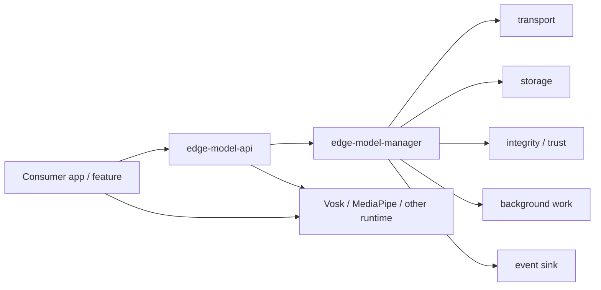

# Reusable Android Model-Delivery SDK Design

This document answers the assignment's SDK design questions directly. It
describes how the OTA download and model-management code demonstrated in
TANUHDemo would become a standalone Android SDK for other application teams.

Edge Voice Assistant implements a focused subset: remote manifest loading, network
policy, version comparison, size and SHA-256 verification, staged activation,
local reuse, and previous-version metadata. Resumable downloads, automatic
runtime-load rollback, staged rollout, cache eviction, and the multi-module SDK
described in this document are proposed production work rather than claims about
the current application.

## 6. How would the OTA and model-management logic become a reusable SDK?

The reusable SDK should own model delivery, trust, storage, and lifecycle, while
remaining independent of Vosk, MediaPipe, or any product feature.

### Extraction approach

1. **Move model-delivery types out of the app**

   `ModelManifest`, `ModelSpec`, model state, sync requests, and error types move
   into a stable `edge-model-api` module.

2. **Move orchestration out of `ModelManager`**

   Manifest resolution, version selection, download, validation, activation,
   rollback, and cache decisions move into `edge-model-manager`.

3. **Replace Android/framework details with interfaces**

   The manager depends on abstractions for transport, storage, crypto, network
   state, background work, clock, installation identity, and observability.

4. **Provide Android implementations separately**

   HTTP transport, app-private file storage, Android connectivity, and
   WorkManager integration live behind those interfaces.

5. **Keep inference runtimes outside the delivery SDK**

   The SDK returns a trusted local model file or directory. The consuming app
   loads it with Vosk, MediaPipe, LiteRT, ONNX Runtime, or another runtime.

6. **Migrate TANUHDemo into the first consumer**

   The app would request the Vosk and MobileBERT IDs, acquire trusted model
   leases, and keep its existing ASR and sentiment adapters.

### Intended boundary



The SDK answers: **Which trusted model version is ready, and where is it?**

The consumer answers: **How should this product use that model for inference?**

## 7. What is the public API surface?

The public API should be small, asynchronous, lifecycle-safe, and independent of
any inference framework.

### Core API

```kotlin
interface EdgeModelSdk {
    fun observe(modelId: ModelId): Flow<ModelState>

    suspend fun sync(request: SyncRequest): SyncResult

    suspend fun acquire(modelId: ModelId): ModelLease

    suspend fun reportLoadResult(
        lease: ModelLease,
        result: ModelLoadResult,
    )
}

@JvmInline
value class ModelId(val value: String)

data class SyncRequest(
    val modelIds: Set<ModelId>,
    val networkPolicy: NetworkPolicy = NetworkPolicy.UnmeteredOnly,
    val forceManifestRefresh: Boolean = false,
)

sealed interface NetworkPolicy {
    data object UnmeteredOnly : NetworkPolicy
    data object AnyValidatedNetwork : NetworkPolicy
    data object CacheOnly : NetworkPolicy
}

sealed interface ModelState {
    data object NotInstalled : ModelState
    data class Checking(val currentVersion: String?) : ModelState
    data class Downloading(
        val version: String,
        val bytesDownloaded: Long,
        val totalBytes: Long,
    ) : ModelState
    data class Ready(val version: String) : ModelState
    data class Failed(
        val error: ModelError,
        val lastKnownGoodVersion: String?,
    ) : ModelState
}

interface ModelLease : Closeable {
    val id: ModelId
    val version: String
    val path: File
    val format: String
    val runtimeHint: String?
}

sealed interface ModelLoadResult {
    data object Success : ModelLoadResult
    data class Failure(val cause: Throwable) : ModelLoadResult
}
```

### SDK construction

```kotlin
val modelSdk = EdgeModelSdkFactory.create(
    context = applicationContext,
    config = EdgeModelConfig(
        manifestUrl =
            "https://raw.githubusercontent.com/UpadhyayJitesh/" +
                "edge-ai-models/main/model-manifest.json",
        trustedManifestKeys = setOf(PRODUCTION_PUBLIC_KEY),
        cacheLimitBytes = 2L * 1024 * 1024 * 1024,
        eventSink = AppModelEventSink(),
    ),
)
```

Construction configuration is application-wide. Per-request choices such as
metered consent remain on `SyncRequest`.

### Consumer usage

```kotlin
val voskId = ModelId("vosk-small-en-us")
val sentimentId = ModelId("mobilebert-text-classifier")

modelSdk.observe(voskId).collect { state ->
    renderModelState(state)
}

val result = modelSdk.sync(
    SyncRequest(
        modelIds = setOf(voskId, sentimentId),
        networkPolicy = if (userAllowedMetered) {
            NetworkPolicy.AnyValidatedNetwork
        } else {
            NetworkPolicy.UnmeteredOnly
        },
    ),
)

if (result is SyncResult.Ready) {
    modelSdk.acquire(voskId).use { voskLease ->
        val voskModel = runCatching {
            VoskModel(voskLease.path.absolutePath)
        }
        modelSdk.reportLoadResult(
            voskLease,
            voskModel.fold(
                onSuccess = { ModelLoadResult.Success },
                onFailure = { ModelLoadResult.Failure(it) },
            ),
        )
    }
}
```

### Why a lease?

A `ModelLease` prevents cache eviction or version cleanup while an inference
runtime is using the model. Closing it releases that protection.

### Public errors

Consumers should receive stable domain errors rather than HTTP or filesystem
implementation details:

```kotlin
sealed interface ModelError {
    data object NetworkUnavailable : ModelError
    data class HttpFailure(val statusCode: Int) : ModelError
    data object ManifestUntrusted : ModelError
    data object ArtifactIntegrityFailure : ModelError
    data object InsufficientStorage : ModelError
    data object NoCompatibleVersion : ModelError
    data object CandidateLoadFailure : ModelError
}
```

## 8. How are versioning, trust, rollback, and staged rollout handled?

### Model versioning

The manifest provides an immutable model ID and version for every artifact.
Production manifests should use a documented comparison scheme such as semantic
versions or monotonically increasing revision numbers.

The SDK:

- Compares the manifest candidate with the active local version.
- Avoids downloading when the same trusted version is already active.
- Keeps versions in separate directories.
- Activates a candidate without requiring an app release.
- Rejects versions incompatible with the device, SDK, or runtime constraints.

The consumer:

- Selects the model IDs required by a feature.
- Decides when to request synchronization.
- Declares runtime compatibility requirements when they are product-specific.

### Integrity and trust

HTTPS alone protects transport but does not provide a complete artifact trust
model. A production catalog should include:

```text
model ID
version
artifact URL
byte size
SHA-256 digest
format/runtime
minimum SDK/runtime version
rollout metadata
manifest signature/key ID
```

The SDK:

1. Fetches the manifest over HTTPS.
2. Verifies its signature using pinned, rotatable public keys.
3. Downloads into a temporary file.
4. Checks exact byte size.
5. Verifies SHA-256.
6. Prepares the candidate in an isolated staging directory.
7. Atomically activates it only after all checks pass.

The consumer supplies the trusted key configuration and its security/update
policy. It does not implement hashing, signature verification, or atomic file
operations.

### Rollback

Download verification is not enough: a valid model can still fail to load on a
specific runtime or device.

The SDK therefore keeps:

- `active`: currently approved version.
- `candidate`: newly verified version awaiting load confirmation.
- `lastKnownGood`: previous version confirmed by the consumer runtime.
- `quarantined`: versions that failed load/health checks.

Flow:

1. Candidate downloads and passes trust checks.
2. SDK exposes it through a lease.
3. Consumer attempts runtime loading.
4. Consumer calls `reportLoadResult()`.
5. Success promotes candidate to last-known-good.
6. Failure quarantines the candidate and restores the prior last-known-good
   version.

The SDK owns rollback mechanics and persistence. The consumer owns the
runtime-specific definition of a successful load and may run an optional smoke
inference before reporting success.

### Staged rollout

Manifest entries can include:

```json
{
  "rollout": {
    "percentage": 25,
    "salt": "mobilebert-v2-wave-1",
    "channels": ["production"]
  }
}
```

The SDK derives a stable bucket from a privacy-safe installation ID plus the
rollout salt. The same installation remains consistently eligible or
ineligible. Increasing the percentage expands rollout without an app update.

The SDK owns deterministic bucketing and enforcement. The consumer selects its
channel and may impose stricter product policy, but it should not implement its
own random rollout logic.

### Responsibility matrix

| Concern | SDK responsibility | Consumer responsibility |
| --- | --- | --- |
| Required models | Resolve and synchronize requested IDs | Choose IDs needed by the feature |
| Connectivity | Enforce requested network constraints | Obtain user consent for metered/large downloads |
| Versioning | Compare, download, store, and activate versions | Decide when the feature requests refresh |
| Integrity | Verify manifest signature, size, digest, and safe extraction | Configure trusted public keys |
| Rollback | Track candidate/LKG, quarantine, restore | Report runtime load or smoke-test result |
| Staged rollout | Stable bucketing and manifest enforcement | Select environment/channel |
| Inference | None | Load model and run domain-specific inference |
| UX | Expose states/progress/errors | Render product-specific UI and fallback behavior |
| Metrics | Emit structured delivery events | Connect events to the app's telemetry system |

## 9. How is the SDK modular and testable?

### Gradle module boundaries

```text
edge-model-api
  Stable public interfaces, states, errors, requests, and leases.
  Kotlin-first with minimal Android dependency.

edge-model-manager
  Version/update state machine and orchestration.
  Depends on interfaces, not concrete HTTP/filesystem implementations.

edge-model-manifest
  Manifest parser, schema validation, compatibility, and rollout selection.

edge-model-network
  HTTP transport, retry/backoff, range requests, and resumable downloads.

edge-model-storage
  Registry, staging, atomic activation, leases, quotas, and LRU eviction.

edge-model-crypto
  SHA-256 and manifest-signature verification.

edge-model-work
  Optional WorkManager foreground/background synchronization.

edge-model-observability
  Optional event types and adapters for app telemetry.
```

Apps that only need foreground synchronization depend on `edge-model-api` plus
the core implementation. WorkManager and telemetry integrations remain optional
so they do not become mandatory transitive dependencies.

### Dependency inversion

`edge-model-manager` depends on interfaces such as:

```kotlin
interface ManifestSource {
    suspend fun fetch(): SignedManifest
}

interface ArtifactTransport {
    suspend fun download(
        request: DownloadRequest,
        progress: (DownloadProgress) -> Unit,
    ): DownloadedArtifact
}

interface ModelStorage {
    suspend fun active(id: ModelId): StoredModel?
    suspend fun stage(spec: ModelSpec, artifact: DownloadedArtifact): StagedModel
    suspend fun activate(staged: StagedModel): StoredModel
    suspend fun rollback(id: ModelId): StoredModel?
}

interface IntegrityVerifier {
    suspend fun verifyManifest(manifest: SignedManifest)
    suspend fun verifyArtifact(file: File, spec: ModelSpec)
}

interface InstallationIdProvider {
    fun stableId(): String
}

interface ModelEventSink {
    fun emit(event: ModelEvent)
}
```

This keeps business rules independent from `HttpURLConnection`, OkHttp,
SharedPreferences, Room, WorkManager, or a particular crypto provider.

### Test strategy

#### Pure JVM unit tests

Use fakes for transport, storage, crypto, clock, installation ID, and events.
Test:

- Cache hit avoids download.
- Newer eligible version downloads.
- Same version is reused.
- Metered policy is enforced.
- Invalid manifest/signature is rejected.
- Size or SHA-256 mismatch never activates.
- Candidate activation occurs only after verification.
- Failed load quarantines candidate and restores last-known-good.
- Rollout bucketing is deterministic.
- Lease prevents eviction.
- Cache quota selects the correct eviction candidate.

#### Contract tests

Run every implementation against shared behavioral contracts:

- Transport supports retry and resume semantics.
- Storage rename/activation is atomic.
- Registry survives process restart.
- Crypto implementations produce expected vectors.
- ZIP extraction rejects path traversal.

#### Android instrumentation tests

Test Android-specific behavior:

- WorkManager network constraints.
- Process death during download or activation.
- App-private storage and low-storage behavior.
- Foreground notification requirements.
- Connectivity transitions.

#### End-to-end tests

Use a local HTTP test server and small fixture artifacts to exercise:

```text
manifest -> download -> verification -> staging -> activation
-> acquire lease -> report load -> last-known-good
```

Large production models are not required for most CI tests.

### Public API stability

- Publish the SDK with semantic versioning.
- Keep implementation classes internal.
- Run Kotlin/Java binary-compatibility validation in CI.
- Add new fields with defaults where source/binary compatibility permits.
- Version the manifest schema independently from the SDK artifact.
- Support at least the previous manifest schema during migrations.
- Expose domain errors rather than third-party exception types.

### Minimal transitive dependencies

- `edge-model-api` should expose Kotlin/Java and Android platform types only.
- HTTP, JSON, database, crypto-provider, WorkManager, and telemetry libraries
  remain implementation details or optional artifacts.
- Inference frameworks are never dependencies of the delivery SDK.
- Consumers can replace default transport/storage implementations through
  dependency injection when needed.

## Summary

The proposed SDK turns the demo's OTA logic into a framework-neutral model
lifecycle service. It owns safe and observable delivery from manifest to trusted
local artifact, while application teams retain control of product UX, consent,
model selection, runtime loading, and inference.
