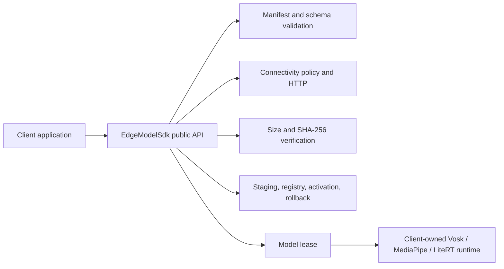

# Reusable Android Model-Delivery SDK

This document answers assignment questions 6-9 using the standalone SDK now
implemented in [UpadhyayJitesh/TANUH_SDK](https://github.com/UpadhyayJitesh/TANUH_SDK).

The published Android library is:

```text
Group:    com.tanuh.edge
Artifact: model-sdk
Version:  0.1.0
```

The SDK owns OTA model delivery and lifecycle management. A consuming application
still owns inference: it loads the verified local path into Vosk, MediaPipe,
LiteRT, ONNX Runtime, or another runtime.

## Current Implementation

Version `0.1.0` implements:

- Remote manifest download and `schemaVersion` validation
- Arbitrary model IDs, versions, runtimes, and formats
- Unmetered, any validated network, and cache-only policies
- First-time and model-update downloads through `sync()`
- Download progress through `Flow<ModelState>`
- Exact byte-size and SHA-256 verification
- Safe ZIP extraction with path-traversal protection
- Temporary download, isolated staging, and activation after validation
- Active and previous-version metadata
- Cached-model reuse and offline availability
- Model leases
- Runtime-load reporting and rollback to a valid previous version
- Structured, injectable logging

The following remain production enhancements rather than current claims:

- Signed manifests and pinned public-key rotation
- HTTP range-based resumable downloads
- Percentage/channel-based staged rollout
- Automated cache quota and retention cleanup
- WorkManager background synchronization
- Telemetry upload adapters

## 6. Extracting OTA Model Management into an SDK

The model-delivery implementation has been extracted into the standalone
`edge-model-sdk` Android library. Its boundary is intentionally independent of
the demo's voice-memo feature and inference frameworks.



The SDK answers:

> Which verified model version is active, and where is its local file or
> directory?

The client answers:

> How should the product load and use that model for inference?

### Consumer dependency

The SDK can be published to a local or remote Maven repository:

```kotlin
dependencies {
    implementation("com.tanuh.edge:model-sdk:0.1.0")
}
```

It exposes no Vosk, MediaPipe, or LiteRT dependency. This keeps inference
framework choice and versioning under the consuming application's control.

## 7. Public API Surface

The implemented public facade is `EdgeModelSdk`:

```kotlin
interface EdgeModelSdk : Closeable {
    fun observe(modelId: ModelId): Flow<ModelState>

    suspend fun sync(request: SyncRequest): SyncResult

    suspend fun acquire(modelId: ModelId): ModelLease

    suspend fun reportLoadResult(
        lease: ModelLease,
        result: ModelLoadResult,
    ): LoadReportResult

    fun installedModels(): Map<ModelId, InstalledModel>
}
```

### Method responsibilities

```text
create()            -> Configures and initializes the SDK instance
observe()           -> Reports model state and download progress
sync()              -> Performs manifest/model preparation and downloads
acquire()           -> Leases an installed and revalidated model
reportLoadResult()  -> Accepts runtime loading or triggers rollback
installedModels()   -> Reads active metadata without network access
close()             -> Releases SDK-owned resources
```

Only `sync()` initiates manifest and model downloads. `create()` and `observe()`
do not start network work.

### Construction

```kotlin
val modelSdk = EdgeModelSdkFactory.create(
    applicationContext,
    EdgeModelConfig(
        manifestUrl =
            "https://raw.githubusercontent.com/UpadhyayJitesh/" +
                "edge-ai-models/main/model-manifest.json",
        supportedSchemaVersion = 1,
    ),
)
```

`EdgeModelConfig` also supports the storage directory name, user agent, network
timeouts, manifest cache age, and an injectable `EdgeModelLogger`.

### Synchronization

```kotlin
val requiredModels = setOf(
    ModelId("vosk-small-en-us"),
    ModelId("mobilebert-text-classifier"),
)

val result = modelSdk.sync(
    SyncRequest(
        modelIds = requiredModels,
        networkPolicy = if (userAllowedMetered) {
            NetworkPolicy.AnyValidatedNetwork
        } else {
            NetworkPolicy.UnmeteredOnly
        },
    ),
)
```

For a fresh installation, `sync()` downloads the manifest and missing models.
For later calls, it reuses a matching model only when its path, declared size,
and SHA-256 remain valid. A changed manifest version causes a new candidate to
be downloaded and verified.

`forceManifestRefresh` forces manifest retrieval; it does not force an unchanged,
valid model artifact to be downloaded again.

### Observation

```kotlin
modelSdk.observe(ModelId("vosk-small-en-us")).collect { state ->
    when (state) {
        ModelState.NotInstalled -> showModelRequired()
        ModelState.Checking -> showChecking()
        is ModelState.Downloading -> showProgress(
            state.bytesDownloaded,
            state.totalBytes,
        )
        is ModelState.Ready -> showReady(state.model.version)
        is ModelState.Failed -> showError(state.error.message)
    }
}
```

Observation is passive. It reflects work performed by `sync()` and state changes
caused by rollback.

### Acquire and use

`acquire()` finds the active model, confirms its local path exists, revalidates
the stored artifact, increments its lease count, and returns an `InstalledModel`:

```kotlin
val lease = modelSdk.acquire(ModelId("mobilebert-text-classifier"))

try {
    val classifier = createClassifier(lease.model.path) // Client-side code
    modelSdk.reportLoadResult(lease, ModelLoadResult.Success)
    classifier.classify(transcript)
} catch (error: Throwable) {
    modelSdk.reportLoadResult(
        lease,
        ModelLoadResult.Failure(error),
    )
} finally {
    lease.close()
}
```

`createClassifier()` and inference are client responsibilities. The SDK supplies
the verified model path and lifecycle protection; it does not instantiate an
inference engine.

### Runtime-load reporting

SHA-256 proves that downloaded bytes match the manifest, but it cannot prove
that a specific runtime/device can load the model. The client therefore reports
the result immediately after runtime construction.

`reportLoadResult()` returns:

- `LoadReportResult.Accepted`: the runtime loaded the active model.
- `LoadReportResult.RolledBack`: loading failed and the previous valid version
  was restored.
- `LoadReportResult.NoRollbackAvailable`: loading failed and no valid previous
  version was available.

Normal inference-input or product-workflow errors after successful runtime
construction should not be reported as model-load failures.

### Installed metadata and closure

`installedModels()` returns active local metadata without network access,
including ID, version, runtime, format, path, SHA-256, and size.

`EdgeModelSdk` extends `Closeable`; therefore `close()` is inherited rather than
separately declared. `ModelLease` also extends `Closeable`.

## 8. Versioning, Integrity, Rollback, and Staged Rollout

### Versioning

The manifest schema version and model versions solve different problems:

- `schemaVersion` versions the JSON contract.
- Each model's `version` controls whether its artifact should be updated.
- The Maven artifact version, currently `0.1.0`, versions the SDK API and
  implementation.

The current SDK compares model version strings for exact equality. When the
manifest version differs from the active version, the SDK downloads the declared
artifact, even if its URL happens to be unchanged. The old model remains active
until the replacement passes size and SHA-256 verification and staging succeeds.

The consumer selects required model IDs and decides when to invoke `sync()`.

### Integrity and trust

The current trust flow is:

1. Fetch the manifest using HTTPS.
2. Validate the supported schema.
3. Download into a temporary file.
4. Validate exact byte size.
5. Validate SHA-256.
6. Safely stage the model or extract its ZIP.
7. Move it into the versioned model store.
8. Persist active metadata last.

A failed download, size mismatch, digest mismatch, or unsafe ZIP does not replace
the active model.

SHA-256 checks artifact integrity but does not authenticate who published the
manifest. Signed manifests with pinned and rotatable keys are the next trust
enhancement.

### Rollback

When a new version is activated, the registry retains the previous model's
metadata. The consumer then tries to construct its runtime and calls
`reportLoadResult()`.

On failure, the SDK:

1. Confirms the failed lease still represents the active version.
2. Finds the previous version.
3. Revalidates its path, size, and SHA-256.
4. Restores its active metadata.
5. Marks the failed candidate as quarantined metadata.
6. Emits `ModelState.Ready` for the restored version.

The SDK owns rollback persistence. The consumer owns the runtime-specific
definition of a successful load.

### Staged rollout

Percentage/channel rollout is not implemented in `0.1.0`. A production manifest
could add rollout percentage, salt, and channel. The SDK would perform stable
installation bucketing and enforce eligibility before download.

The consumer would select an environment/channel and may impose stricter product
policy, but deterministic bucketing should remain inside the SDK.

### Responsibility matrix

| Concern | SDK | Consumer |
| --- | --- | --- |
| Required models | Resolves and synchronizes requested IDs | Selects feature model IDs |
| Connectivity | Enforces requested network policy | Obtains metered-download consent |
| Version update | Compares, downloads, validates, and activates | Decides when to call `sync()` |
| Integrity | Checks schema, size, SHA-256, and safe extraction | Publishes correct trusted metadata |
| Runtime loading | Supplies a verified leased path | Creates Vosk/MediaPipe/LiteRT runtime |
| Rollback | Restores a valid previous version | Reports runtime load result |
| UI | Exposes states, progress, and errors | Renders product-specific UX |
| Inference | None | Runs transcription, sentiment, or other inference |
| Staged rollout | Future bucketing/enforcement | Future channel/product policy |

## 9. Modularity and Testability

### Current Gradle boundary

The current repository deliberately starts with one focused Android library:

```text
TANUH_SDK/
├── edge-model-sdk/
│   ├── public API
│   ├── manifest parser
│   ├── network-policy evaluator
│   ├── downloader and lifecycle orchestrator
│   ├── storage registry
│   └── integrity and ZIP utilities
├── docs/
└── README.md
```

This avoids publishing multiple nearly empty artifacts while the API is still
small. Implementation types remain `internal`; consumers depend only on
`com.tanuh.edge.models` public types.

The public library exposes coroutines for `Flow` and suspending operations. It
does not transitively expose an inference framework, HTTP client, database,
WorkManager, or telemetry SDK.

### Current tests

JVM tests currently cover:

- Valid manifest parsing
- Unsupported schema rejection
- Duplicate model-ID rejection
- SHA-256 and exact-size validation
- Invalid digest rejection
- ZIP path-traversal rejection

Both debug and release unit-test variants pass, and Android lint is run against
the SDK.

### Recommended next tests

The next production test layer should add fake transport and storage boundaries
or a local HTTP test server to verify:

- Cache hit avoids artifact download.
- Network policy prevents disallowed downloads.
- Changed version downloads and activates.
- Failed size/SHA validation preserves the active version.
- Process restart restores registry state.
- Runtime-load failure restores last-known-good.
- Lease counts protect versions selected for cleanup.
- Interrupted and resumed downloads behave correctly.

Android instrumentation tests should cover connectivity transitions,
app-private storage, low-storage conditions, and process death around activation.

### Future module split

If the implementation grows, its internal boundaries can become separate
artifacts:

```text
edge-model-api
edge-model-manager
edge-model-manifest
edge-model-network
edge-model-storage
edge-model-integrity
edge-model-work        (optional)
edge-model-telemetry   (optional)
```

That split should happen when it removes meaningful dependency or ownership
complexity. The stable `EdgeModelSdk` facade and Maven coordinates should shield
clients from internal restructuring.

### API stability

- Use semantic versioning for the SDK artifact.
- Version the manifest schema independently.
- Keep implementation classes internal.
- Prefer additive API changes with defaults.
- Expose SDK domain errors instead of HTTP/filesystem exception types.
- Add binary-compatibility validation before a stable `1.0.0` release.

## Summary

`TANUH_SDK 0.1.0` is now a working extraction of the demo's OTA model lifecycle,
not only a proposed design. It manages delivery from manifest through verified
local activation and rollback, while TANUHDemo and other clients retain control
of UX, runtime construction, and on-device inference.
